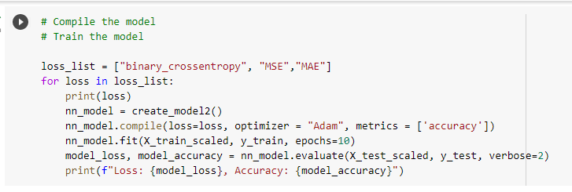

# Overview of the analysis: 

The nonprofit foundation Alphabet Soup wants a tool that can help it select the applicants for funding with the best chance of success in their ventures. We are trying to predict whether applicants will be successful if funded by Alphabet Soup.

# Data Processing:

After importing and reading the data from the CSV file, we dropped two columns because they were considered neither targets nor features for the model.
The columns ```EIN``` and ```NAME``` were dropped from the model. The remaining columns were considered features for the model. The target variable for the model was labeled ```IS_SUCCESSFUL``` and has the value of 1
for yes and 0 for no. Then we looked at unique vales for each column. We paid specific attention to the columns which had more than 10 unique values. We then used the number of data points for each unique value to pick a cutoff point to bin "rare" categorical variables together in a new value - "Other", and then check if the binning was successful. Both ```CLASSIFICATION``` and ```APPLICATION_TYPE``` columns were condensed with binning.
Categorical variables were encoded by ```pd.get_dummies()```.
The data was then split into training and testing sets of data. Then we used ```StandardScaler``` to standardise the data.

Compiling, Training, and Evaluating the Model


We started with a two-layer training model with 80 and 30 neurons which generated 6061 parameters. The activation function used was "Relu". We compiled the model using Binary-Crossentropy as the loss function and "Adam" as the optimizer.
We then fitted the model with 100 epochs.


The predictive accuracy of the first attempt came to 72.5% which was under the desired 75%.

# Optimizations:

I tried several methods to increase model performance-

## 1. Using KerasTuner
KerasTuner is an easy-to-use, scalable hyperparameter optimization framework. We evaluated the top 3 models from this optimization process.


None of these models had accuracy over 75%


## 2. Changing the "LOSS" function

Then we tried to improve the accuracy of the model by trying out different loss functions. Loss is a number indicating how bad the model's prediction was on a single example. If the model's prediction is perfect, the loss is zero; otherwise, the loss is greater. We tried "Binary-crossentropy", "MSE",and "MAE" functions.


Again, none of these models had accuracy over 75%

Binary-crossentropy:
Loss: 0.55327969789505, Accuracy: 0.7252478003501892

MSE:
Loss: 0.18820101022720337, Accuracy: 0.7203498482704163

MAE:
Loss: 0.2749268412590027, Accuracy: 0.7251312136650085

## 3. Changing the "Optimizer" function

An optimizer is a function that modifies the attributes of the neural network, such as weights and learning rates. Thus, it helps in reducing the overall loss and improving accuracy.
We tried "Adagrad", "SGD" and "Adam" optimizers.


None of these models had accuracy over 75%

Adagrad: Loss: 0.5822843313217163, Accuracy: 0.7204664945602417

SGD: Loss: 0.5598658919334412, Accuracy: 0.7251312136650085

Adam: Loss: 0.551693856716156, Accuracy: 0.7251312136650085

## 4. Increasing columns and layers

In this attempt we added ‘NAME’ back into the dataset. Also, we added another hidden layer.


With this method we achieved an accuracy of 78.9%. This is the only method that optimized the model to achieve higher than 75% accuracy.


# Summary
To summarize our analysis, even though with the last optimization of adding an extra column increased the accuracy of 
the model higher than 75%, I would not recommend the model. In most situations, more data is usually better. 
That said, one situation where more data does not help is if your additional training data doesn't match whatever 
you are trying to predict. I feel the name of a venture should not affect the outcome of venture and hence I think 
```NAME``` an unnecessary column to add to the model. I would recommend the first model predicted by the KerasTuner 
process with an accuracy of 73% with 'tanh' activation.
